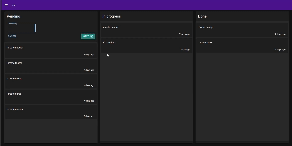

# Kanban Board

## Description

This is a Next.js project that uses the following technologies:

- Next.js
- React
- Emotion for styling
- MUI for UI components
- Axios for HTTP requests
- date-fns for date manipulation
- Mongoose for MongoDB object modeling
- notistack for notification stacks
- uuid for unique identifiers

## Installation

To install the project, follow these steps:

1. Clone the repository
2. Run `npm install` to install the dependencies

## Running the Project

To run the project:

- For development, use `npm run dev`
- To build the project, use `npm run build`
- To start the project, use `npm run start`

## Linting

To lint the project, use `npm run lint`

## Demo

